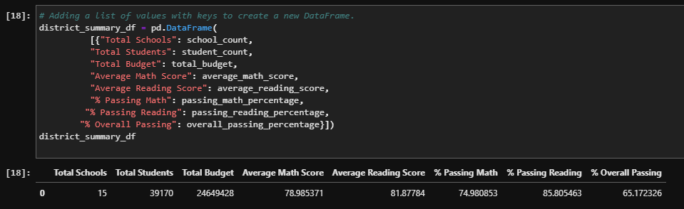
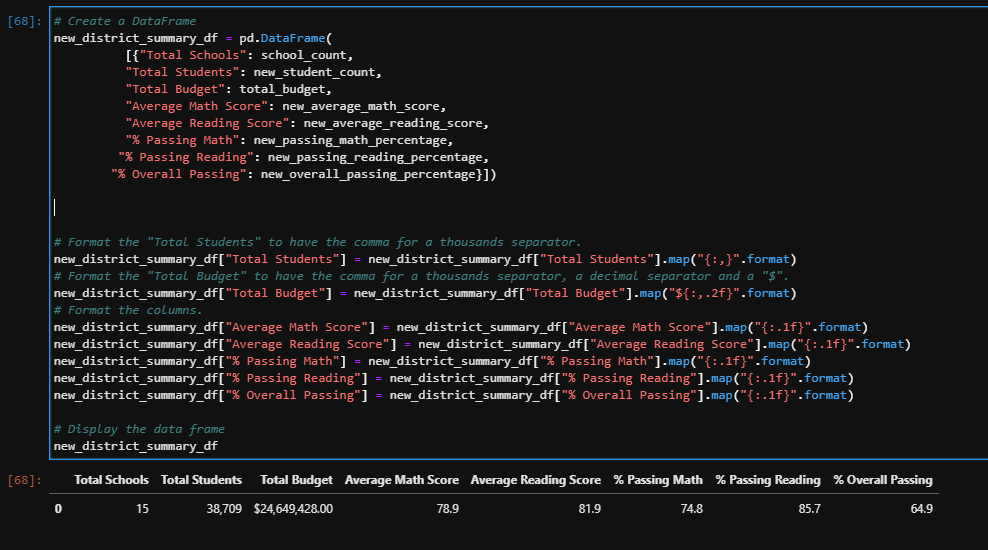

# School_District_Analysis
## Overview 

The purpose of this project, was to to perform an analysis on the reading and math scores for the high schools in a school district. After the initial analysis was performed, it was brought to the attention of the district that there were dishonest test scores in the 9th grade for Thomas High School. Therefore, the scores for those students were replaced in the dataset with null values, and the school various school district analyses were performed and compared to the previous analysis.
## Results
### Changes to School District Analysis:
The following images show the district_summary_df printed from the lesson, and from the challenge. Notice the student count is different, this is because in the second image, the 9th graders from thomas high school have been removed.

*The following image shows the district summary from the lesson module*

*The following image shows the district summary from the challenge, after replacing 9th graders from thomas high with 'NaN*

Additionally, one can see that the percentages to the tenths place, have marginally changed for passing math and passing reading.

### Changes to School Summary
- Change in the school summary: Thomas high school, before removing the false 9th grade numbers from the dataset, had an overall passing percent of over 90.94%, but after the freshman grades were removed, the overall passing percent dropped to 90.63%.

- Math and reading score by grade: These were affected simply because 9th grade scores for thomas high were replaced by NaN. Additionally, the numbers for the 10th-12th graders changed as well, because the mean() function was used to determine these results, and the denominator which was the total number of non-null values changed in the dataframe after removing the 9th grade numbers.
- Scores by school spending, size and type: This was not affected to the 10th decimal place as is evident in the PyCitySchools notebook versus the PyCitySChools_Challenge notebook.

## Summary
- Most of the major changes to the analysis are in the district analysis and the school summary. In the district summary, the district totals fared better off without the thomas high school 9th grader grades with marginally higher passing percentages. Secondly, In the per school summary, the passing percentages for thomas high school dropped marginally when just summarizing the 10th-12th grade scores. Thirdly, when comparing the scores by grade, the dataframes were affected by replacing the 9th grade scores. Much of the rest of the analysis stayed the same, such as top and bottom ranking schools, and results based on spending, size, and type of school.